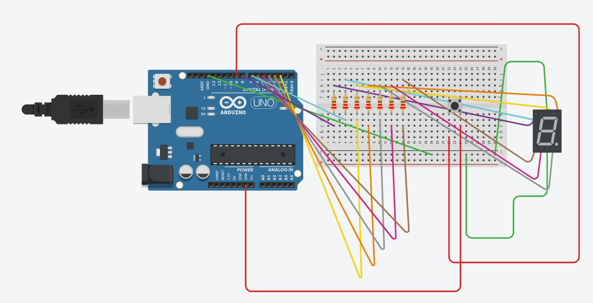
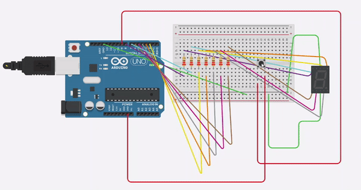

# Digital-Dice

Created a Digital Dice using a 7 segment display, Arduino UNO and Push Button Switch

As we push the push button a random number from 1 to 6 comes up on the 7 segment display, similar to that in a dice

# The circuit diagram of the digital dice is- 

# A simulation of the working of the digital dice-

